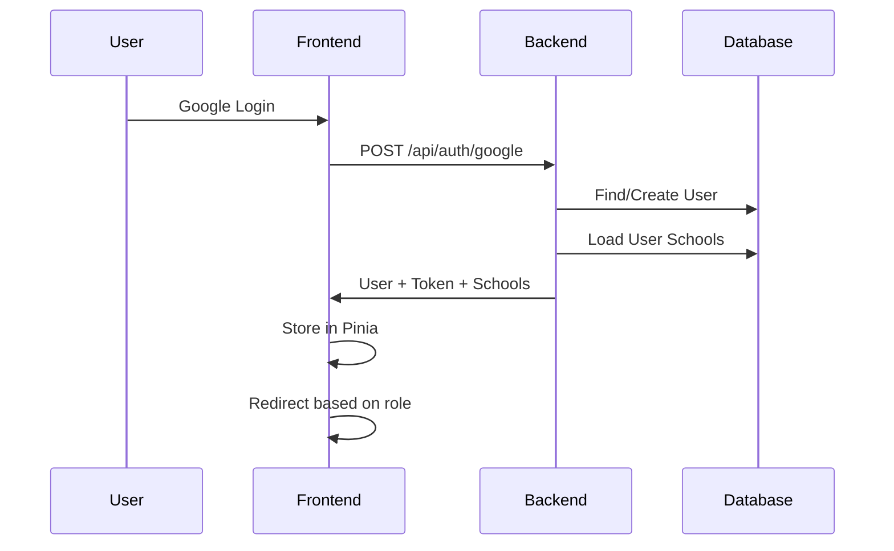
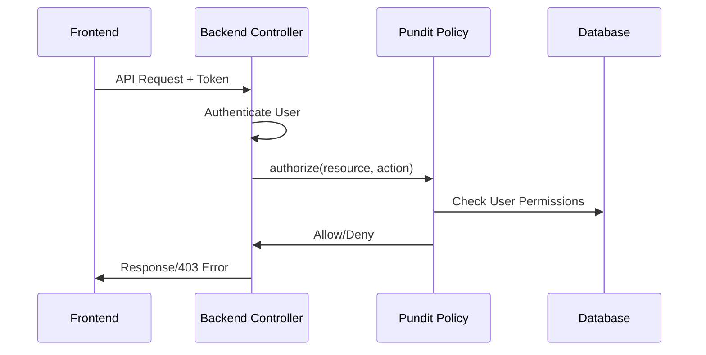
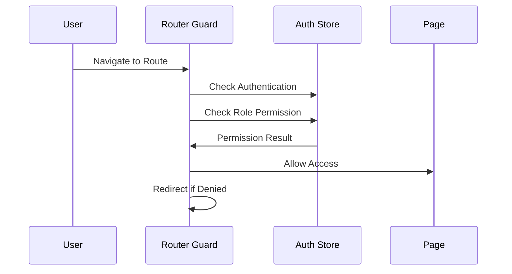

# 權限管理系統文件

ClubBridge 系統的完整權限管理架構文件，包含後端 Rails + Pundit 與前端 Vue3 + Pinia 的整合實作。

---

## 📚 目錄

1. [系統架構概覽](#系統架構概覽)
2. [後端權限系統](#後端權限系統)
3. [前端權限系統](#前端權限系統)
4. [權限檢查流程](#權限檢查流程)
5. [角色與權限對應](#角色與權限對應)
6. [常見問題與解決方案](#常見問題與解決方案)
7. [開發指南](#開發指南)

---

## 🏗 系統架構概覽

```
┌─────────────────┐    ┌─────────────────┐    ┌─────────────────┐
│   前端 Vue3     │    │   後端 Rails    │    │   資料庫 DB     │
│                 │    │                 │    │                 │
│ Router Guards   │◄──►│ Pundit Policies │◄──►│ User Model      │
│ Pinia Store     │    │ Controller      │    │ School Model    │
│ Role Checks     │    │ Authorization   │    │ Membership      │
└─────────────────┘    └─────────────────┘    └─────────────────┘
```

---

## 🔒 後端權限系統

### User Model 角色定義

```ruby
# app/models/user.rb
class User < ApplicationRecord
  # 角色枚舉
  enum :user_role, { 
    school_admin: 0,    # 學校管理員
    super_admin: 1,     # 超級管理員
    teacher: 2          # 社團老師
  }
  
  # 關聯
  has_many :memberships, dependent: :destroy
  has_many :schools, through: :memberships
end
```

### Membership Model 學校成員關係

```ruby
# app/models/membership.rb
class Membership < ApplicationRecord
  belongs_to :user
  belongs_to :school
  
  # 角色枚舉
  enum :role, { 
    admin: 0,    # 學校管理員
    teacher: 1   # 社團老師
  }
end
```

### Pundit Policies

#### ApplicationPolicy (基礎策略)

```ruby
# app/policies/application_policy.rb
class ApplicationPolicy
  def initialize(user, record)
    @user = user
    @record = record
  end

  def index?
    false
  end

  def show?
    false
  end

  def create?
    false
  end

  def update?
    false
  end

  def destroy?
    false
  end

  private

  attr_reader :user, :record
end
```

#### SchoolPolicy (學校權限策略)

```ruby
# app/policies/school_policy.rb
class SchoolPolicy < ApplicationPolicy
  def index?
    user&.super_admin?
  end

  def show?
    user&.super_admin? || user_has_school_access?
  end

  def create?
    user&.super_admin?
  end

  def update?
    user&.super_admin? || user_is_school_admin?
  end

  def approve?
    user&.super_admin?
  end

  def reject?
    user&.super_admin?
  end

  private

  def user_has_school_access?
    return false unless user
    user.schools.include?(record)
  end

  def user_is_school_admin?
    return false unless user
    membership = user.memberships.find_by(school: record)
    membership&.admin?
  end
end
```

#### SchoolSettingPolicy (學校設定權限策略)

```ruby
# app/policies/school_setting_policy.rb
class SchoolSettingPolicy < ApplicationPolicy
  def show?
    user&.super_admin? || user_has_school_access?
  end

  def create?
    user&.super_admin? || user_is_school_admin?
  end

  def update?
    user&.super_admin? || user_is_school_admin?
  end

  private

  def user_has_school_access?
    return false unless user
    school = record.is_a?(School) ? record : record.school
    user.schools.include?(school)
  end

  def user_is_school_admin?
    return false unless user
    school = record.is_a?(School) ? record : record.school
    membership = user.memberships.find_by(school: school)
    membership&.admin?
  end
end
```

### Controller 權限檢查

```ruby
# app/controllers/api/admin/schools_controller.rb
class Api::Admin::SchoolsController < ApplicationController
  before_action :authenticate_user!
  before_action :set_school, only: [:show, :approve, :reject]

  def index
    authorize :school, :index?
    # 只有超級管理員能查看所有學校
    schools = policy_scope(School)
    render json: schools
  end

  def show
    authorize @school
    render json: @school
  end

  def approve
    authorize @school
    # 實作核准邏輯
  end

  private

  def set_school
    @school = School.find(params[:id])
  end
end
```

### 認證控制器回傳用戶資訊

```ruby
# app/controllers/api/auth_controller.rb
def me
  if @current_user
    schools = @current_user.schools.map do |school|
      membership = @current_user.memberships.find_by(school: school)
      {
        id: school.id,
        name: school.name,
        membership_role: membership&.role
      }
    end

    render json: {
      id: @current_user.id,
      name: @current_user.name,
      email: @current_user.email,
      type: 'user',
      user_role: @current_user.user_role,
      schools: schools
    }
  end
end
```

---

## 🎯 前端權限系統

### Pinia Auth Store

```typescript
// frontend/src/stores/auth.ts
import { ref, computed } from 'vue'
import { defineStore } from 'pinia'

export const useAuthStore = defineStore('auth', () => {
  // 狀態
  const user = ref<User | null>(null)
  const token = ref<string | null>(localStorage.getItem('auth_token'))
  const currentSchool = ref<number | null>(null)

  // 計算屬性 - 角色檢查
  const isAuthenticated = computed(() => !!token.value && !!user.value)
  const userRole = computed(() => user.value?.user_role || user.value?.type)
  const isSuperAdmin = computed(() => userRole.value === 'super_admin')
  const isSchoolAdmin = computed(() => userRole.value === 'school_admin')
  const isTeacher = computed(() => userRole.value === 'teacher')
  const isStudent = computed(() => user.value?.type === 'student')

  // 學校權限檢查
  const hasSchoolAccess = computed(() => (schoolId: number) => {
    if (isSuperAdmin.value) return true
    return user.value?.schools?.some(school => school.id === schoolId) || false
  })

  const isSchoolAdminOf = computed(() => (schoolId: number) => {
    if (isSuperAdmin.value) return true
    const school = user.value?.schools?.find(s => s.id === schoolId)
    return school?.membership_role === 'admin'
  })

  return {
    // 狀態
    user,
    token,
    currentSchool,
    
    // 計算屬性
    isAuthenticated,
    userRole,
    isSuperAdmin,
    isSchoolAdmin,
    isTeacher,
    isStudent,
    hasSchoolAccess,
    isSchoolAdminOf,
    
    // 方法
    // ... 其他方法
  }
})
```

### TypeScript 型別定義

```typescript
// frontend/src/types/auth.ts
export interface User {
  id: number
  name: string
  email: string
  type: 'user' | 'student'
  user_role?: 'super_admin' | 'school_admin' | 'teacher'
  schools?: UserSchool[]
  // 其他欄位...
}

export interface UserSchool {
  id: number
  name: string
  membership_role: string  // 'admin' | 'teacher'
}
```

### Vue Router 權限守衛

```typescript
// frontend/src/router/index.ts
router.beforeEach(async (to, from, next) => {
  const authStore = useAuthStore()

  // 初始化認證狀態
  if (!authStore.user && authStore.token) {
    try {
      await authStore.initialize()
    } catch (error) {
      console.error('Auth initialization failed:', error)
    }
  }

  // 檢查認證要求
  if (to.meta.requiresAuth && !authStore.isAuthenticated) {
    return next('/')
  }

  // 檢查角色權限
  if (to.meta.role) {
    const hasPermission = checkRolePermission(authStore, to.meta.role as string)
    if (!hasPermission) {
      return redirectBasedOnRole(authStore, next)
    }
  }

  next()
})

// 角色權限檢查函數
function checkRolePermission(authStore: any, requiredRole: string): boolean {
  switch (requiredRole) {
    case 'super_admin':
      return authStore.isSuperAdmin
    case 'school_admin':
      return authStore.isSchoolAdmin || authStore.isSuperAdmin
    case 'teacher':
      return authStore.isTeacher || authStore.isSchoolAdmin || authStore.isSuperAdmin
    case 'student':
      return authStore.isStudent
    default:
      return false
  }
}
```

### 路由配置

```typescript
// 路由權限設定
const routes = [
  // 超級管理員路由
  {
    path: '/admin',
    component: () => import('@/layouts/AdminLayout.vue'),
    meta: { requiresAuth: true, role: 'super_admin' },
    children: [
      // 超級管理員子路由...
    ]
  },
  
  // 學校管理員路由
  {
    path: '/schools/:schoolId/admin',
    component: () => import('@/layouts/SchoolAdminLayout.vue'),
    meta: { requiresAuth: true, role: 'school_admin' },
    children: [
      // 學校管理員子路由...
    ]
  }
]
```

---

## 🔄 權限檢查流程

### 1. 用戶登入流程



### 2. API 請求權限檢查



### 3. 前端路由權限檢查



---

## 👥 角色與權限對應

### 權限矩陣

| 功能 | 超級管理員 | 學校管理員 | 社團老師 | 學生 |
|------|-----------|-----------|----------|------|
| 查看所有學校 | ✅ | ❌ | ❌ | ❌ |
| 審核學校申請 | ✅ | ❌ | ❌ | ❌ |
| 用戶權限管理 | ✅ | ❌ | ❌ | ❌ |
| 管理所屬學校 | ✅ | ✅ | ❌ | ❌ |
| 學生資料管理 | ✅ | ✅ | ❌ | ❌ |
| 社團資料管理 | ✅ | ✅ | ❌ | ❌ |
| 系統設定 | ✅ | ✅ | ❌ | ❌ |
| 社團點名成績 | ✅ | ✅ | ✅ | ❌ |
| 選社報名 | ❌ | ❌ | ❌ | ✅ |
| 查看選社結果 | ❌ | ❌ | ❌ | ✅ |

### 路由權限設定

```typescript
// 路由權限對應
const routePermissions = {
  '/admin': 'super_admin',                    // 超級管理員後台
  '/admin/schools': 'super_admin',            // 學校管理
  '/admin/users': 'super_admin',              // 用戶管理
  '/schools/:id/admin': 'school_admin',       // 學校管理員後台
  '/schools/:id/teacher': 'teacher',          // 社團老師頁面
  '/schools/:id/student': 'student'           // 學生頁面
}
```

---

## 🚨 常見問題與解決方案

### 1. 403 Forbidden 錯誤

**問題**：API 請求返回 403 錯誤

**可能原因**：
- 用戶沒有對應權限
- Pundit Policy 設定錯誤
- 用戶角色資料不正確

**解決步驟**：
```bash
# 1. 檢查用戶角色
rails console
> user = User.find(USER_ID)
> user.user_role
> user.schools.pluck(:id, :name)

# 2. 檢查 Policy
> policy = SchoolPolicy.new(user, school)
> policy.show?

# 3. 檢查前端認證狀態
console.log(authStore.userRole)
console.log(authStore.user?.schools)
```

### 2. 路由重定向循環

**問題**：頁面不斷重定向

**可能原因**：
- 路由守衛邏輯錯誤
- 角色檢查函數返回錯誤結果

**解決方法**：
```typescript
// 檢查路由守衛邏輯
console.log('Route guard:', { 
  to: to.path, 
  userRole: authStore.userRole, 
  isAuthenticated: authStore.isAuthenticated,
  requiredRole: to.meta.role 
})
```

### 3. 用戶資料不同步

**問題**：前端用戶資料與後端不一致

**解決方法**：
```typescript
// 重新載入用戶資料
await authStore.getCurrentUser()
```

### 4. 學校權限檢查失敗

**問題**：用戶無法訪問有權限的學校

**檢查步驟**：
```bash
# 檢查 Membership 關係
rails console
> user = User.find(USER_ID)
> user.memberships.includes(:school).each do |m|
>   puts "School: #{m.school.name}, Role: #{m.role}"
> end
```

---

## 📝 開發指南

### 新增權限檢查

#### 1. 後端新增 Policy

```ruby
# app/policies/new_resource_policy.rb
class NewResourcePolicy < ApplicationPolicy
  def index?
    user&.super_admin? || user_has_access?
  end

  def show?
    user&.super_admin? || user_owns_resource?
  end

  private

  def user_has_access?
    # 實作權限邏輯
  end

  def user_owns_resource?
    # 實作資源擁有權檢查
  end
end
```

#### 2. Controller 中使用 Policy

```ruby
class NewResourceController < ApplicationController
  before_action :authenticate_user!

  def index
    authorize :new_resource, :index?
    # 控制器邏輯
  end

  def show
    @resource = NewResource.find(params[:id])
    authorize @resource
    # 控制器邏輯
  end
end
```

#### 3. 前端權限檢查

```vue
<template>
  <div>
    <!-- 條件渲染 -->
    <button v-if="canEdit" @click="editResource">編輯</button>
    
    <!-- 使用計算屬性 -->
    <div v-show="hasAccess">敏感內容</div>
  </div>
</template>

<script setup>
import { computed } from 'vue'
import { useAuthStore } from '@/stores/auth'

const authStore = useAuthStore()

const canEdit = computed(() => {
  return authStore.isSuperAdmin || authStore.isSchoolAdmin
})

const hasAccess = computed(() => {
  return authStore.hasSchoolAccess(schoolId)
})
</script>
```

### 測試權限系統

#### 1. 後端測試

```ruby
# spec/policies/school_policy_spec.rb
RSpec.describe SchoolPolicy do
  subject { described_class }

  let(:super_admin) { create(:user, user_role: :super_admin) }
  let(:school_admin) { create(:user, user_role: :school_admin) }
  let(:school) { create(:school) }

  describe '#show?' do
    it 'allows super_admin' do
      expect(subject.new(super_admin, school).show?).to be true
    end

    it 'allows school_admin with access' do
      create(:membership, user: school_admin, school: school, role: :admin)
      expect(subject.new(school_admin, school).show?).to be true
    end

    it 'denies school_admin without access' do
      expect(subject.new(school_admin, school).show?).to be false
    end
  end
end
```

#### 2. 前端測試

```typescript
// tests/stores/auth.spec.ts
import { describe, it, expect } from 'vitest'
import { useAuthStore } from '@/stores/auth'

describe('Auth Store', () => {
  it('correctly identifies super admin', () => {
    const store = useAuthStore()
    store.user = { user_role: 'super_admin' } as User
    
    expect(store.isSuperAdmin).toBe(true)
    expect(store.hasSchoolAccess(1)).toBe(true)
  })

  it('correctly checks school access', () => {
    const store = useAuthStore()
    store.user = {
      user_role: 'school_admin',
      schools: [{ id: 1, name: 'Test School', membership_role: 'admin' }]
    } as User
    
    expect(store.hasSchoolAccess(1)).toBe(true)
    expect(store.hasSchoolAccess(2)).toBe(false)
  })
})
```

### 除錯工具

#### 1. 權限除錯 Helper

```ruby
# app/controllers/concerns/debug_permissions.rb
module DebugPermissions
  def debug_permissions(resource, action)
    return unless Rails.env.development?
    
    policy = policy(resource)
    Rails.logger.debug "=== Permission Debug ==="
    Rails.logger.debug "User: #{current_user&.name} (#{current_user&.user_role})"
    Rails.logger.debug "Resource: #{resource.class.name}"
    Rails.logger.debug "Action: #{action}"
    Rails.logger.debug "Result: #{policy.public_send(action)}"
    Rails.logger.debug "========================"
  end
end
```

#### 2. 前端權限除錯

```typescript
// composables/usePermissionDebug.ts
export function usePermissionDebug() {
  const authStore = useAuthStore()
  
  function debugRoutePermission(routeName: string, requiredRole: string) {
    console.group(`🔒 Route Permission Debug: ${routeName}`)
    console.log('User Role:', authStore.userRole)
    console.log('Required Role:', requiredRole)
    console.log('Is Authenticated:', authStore.isAuthenticated)
    console.log('Permission Result:', checkRolePermission(authStore, requiredRole))
    console.groupEnd()
  }
  
  return { debugRoutePermission }
}
```

---

## 📋 檢查清單

開發新功能時的權限檢查清單：

### 後端檢查
- [ ] 建立對應的 Pundit Policy
- [ ] Controller 中加入 `authorize` 呼叫
- [ ] 測試各種角色的權限情況
- [ ] 確認 API 回傳正確的用戶資訊

### 前端檢查
- [ ] 路由加入正確的 `meta.role` 設定
- [ ] 組件中加入權限檢查
- [ ] 測試路由守衛功能
- [ ] 確認錯誤處理機制

### 整合測試
- [ ] 測試完整的登入到訪問流程
- [ ] 驗證不同角色的權限隔離
- [ ] 確認 403 錯誤處理
- [ ] 測試 token 過期處理

---

## 🔧 維護建議

1. **定期檢查權限邏輯**：隨著功能增加，定期檢視權限設定是否合理

2. **統一錯誤處理**：建立一致的權限錯誤處理機制

3. **文件同步更新**：新增功能時同步更新此文件

4. **權限測試覆蓋**：確保所有權限邏輯都有對應的測試

5. **安全審計**：定期進行安全審計，檢查是否有權限漏洞

---

*最後更新：2025-07-12*
*版本：v1.0*